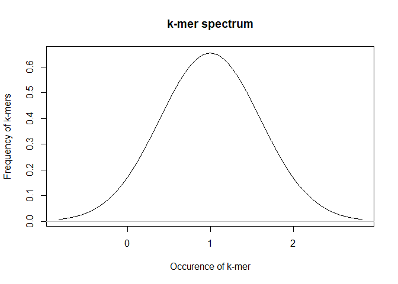
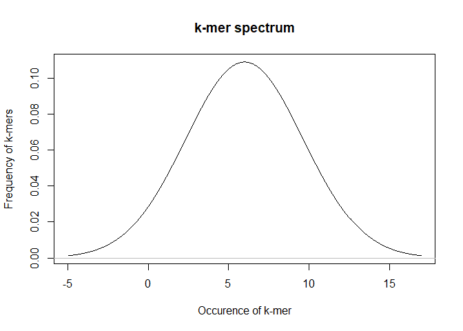
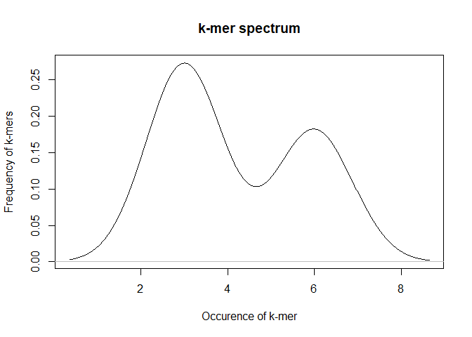

What is a k-mer spectrum?
================
Corentin Molitor
2023-02-02

## k-mer spectrum

A K-mer spectrum is a representation of the k-mer content of your
sequencing data (or genome). They are useful to both estimate the genome
size and the % of heterozygosity of your sample.

A k-mer spectrum represents how many unique k-mers (sequences) are
present a certain number of copies in the data.

## Building a k-mer spectrum from a single read

If we have a single read, then we obtain “L - k + 1” k-mers, where L is
the length of the read and k is the k-mer size.

``` r
read <- "CAGTCGATT"
k <- 3
kmers <- c()

for(i in c(1:(nchar(read)-k+1))) {
  kmers <- c(kmers, substr(x = read, start = i, stop = i+k-1))
}
```

    ## [1] "CAGTCGATT"

    ## [1] "CAG"
    ## [1] " AGT"
    ## [1] "  GTC"
    ## [1] "   TCG"
    ## [1] "    CGA"
    ## [1] "     GAT"
    ## [1] "      ATT"

``` r
print(table(kmers))
```

    ## kmers
    ## AGT ATT CAG CGA GAT GTC TCG 
    ##   1   1   1   1   1   1   1

From the original read, we obtained 7 unique k-mers, each with an
occurence of 1 (this might not always be the case and is dependent on
the k-mer size and complexity of the original sequence, a larger k
increasing the probability of each k-mer being unique, at the expense of
increased computational cost).

Now that we have the k-mers, we can plot their density:

``` r
kmer_counts <- table(kmers)

plot(density(kmer_counts), main = "k-mer spectrum", 
     xlab = "Occurence of k-mer", ylab = "Frequency of k-mers")
```

<!-- -->

Since each k-mer is unique, the occurence (x-axis) of each k-mer is 1.
So the k-mer spectrum has a peak at x = 1. The height of the peak
corresponds to the frequency of k-mers with that occurence (here
frequency=7, because we have 7 different k-mer sequences).

## Building a k-mer spectrum from sequencing data

However, when we sequence a genome, we have many reads (millions), that
are spawned from many copies of the original genome.

Let’s simulate sequencing data from our original read and build the
k-mer counts again:

``` r
# Create 6 copies of the read:
reads <- rep(x = read, times = 6)

k <- 3
kmers <- c()

# For each read:
for(j in c(1:length(reads))){
  read_j <- reads[j]
  # We obtain the k-mers:
  for(i in c(1:(nchar(read_j)-k+1))) {
    kmers <- c(kmers, substr(x = read_j, start = i, stop = i+k-1))
  }
}

print(kmers)
```

    ##  [1] "CAG" "AGT" "GTC" "TCG" "CGA" "GAT" "ATT" "CAG" "AGT" "GTC" "TCG" "CGA"
    ## [13] "GAT" "ATT" "CAG" "AGT" "GTC" "TCG" "CGA" "GAT" "ATT" "CAG" "AGT" "GTC"
    ## [25] "TCG" "CGA" "GAT" "ATT" "CAG" "AGT" "GTC" "TCG" "CGA" "GAT" "ATT" "CAG"
    ## [37] "AGT" "GTC" "TCG" "CGA" "GAT" "ATT"

Obviously, we now have multiple copies of the same k-mers (they are
coming from copies of the same read). This can be checked by the unique
k-mer sequences:

``` r
print(table(kmers))
```

    ## kmers
    ## AGT ATT CAG CGA GAT GTC TCG 
    ##   6   6   6   6   6   6   6

And we can print the density again:

``` r
kmer_counts <- table(kmers)

plot(density(kmer_counts), main = "k-mer spectrum", 
     xlab = "Occurence of k-mer", ylab = "Frequency of k-mers")
```

<!-- -->

Since we have 6 copies of the same read, we have 6 copies of each k-mer.
On the k-mer spectrum this is represented by a peak at x = 6. The
frequency (y-axis) is the same as before (we have 7 unique k-mer
sequences: “CAG” “AGT” “GTC” “TCG” “CGA” “GAT” and “ATT”).

## Sequencing errors

Reads are not perfect. Often, sequencing errors appear in the reads.
Let’s add a read with an error to our sequencing data:

``` r
read_with_error <- read
# Changing A to T in one of the reads:
substr(x = read_with_error, start = 1, stop = 1) <- "T"
reads_with_error <- c(reads, read_with_error)

k <- 3
kmers <- c()

# For each read:
for(j in c(1:length(reads_with_error))){
  read_j <- reads_with_error[j]
  # We obtain the k-mers:
  for(i in c(1:(nchar(read_j)-k+1))) {
    kmers <- c(kmers, substr(x = read_j, start = i, stop = i+k-1))
  }
}

print(table(kmers))
```

    ## kmers
    ## AGT ATT CAG CGA GAT GTC TAG TCG 
    ##   7   7   6   7   7   7   1   7

We can see that a new k-mer appeared (TAG), due to the sequencing error.
Since the error is only present in one read, the occurence of that k-mer
is 1.

``` r
kmer_counts <- table(kmers)

plot(density(kmer_counts), main = "k-mer spectrum", 
     xlab = "Occurence of k-mer", ylab = "Frequency of k-mers")
```

<!-- -->

This is represented on the k-mer spectrum with a peak at x = 1. There is
another peak at x = 6, because one of the k-mers (GAT) has been replaced
by (TAG) due to the sequencing error.

With real datasets, since we are dealing with so many reads, errors are
represented as a large peak at the start of the spectrum:

<!-- -->

The left part of the plot corresponds to k-mers with very low copies
(likely to come from sequencing errors), and this part of the plot if
often ignored in downstream analyses (eg: genome size estimation).

## What about heterozygosity:

If a genome is heterozygous (and diploid). Then each read is as likely
to come from any of the two copies.

``` r
# We have two reads from the same location, but different haplotypes:
# Notice that the 3rd position changes from one read to the other (G>C) 
read_h1 <- "CAGTCGATT"
read_h2 <- "CACTCGATT"
```

Our sequencing data will have a mix of both reads:

``` r
reads <- c(rep(x = read_h1, times = 3),
           rep(x = read_h2, times = 3))

k <- 3
kmers <- c()

# For each read:
for(j in c(1:length(reads))){
  read_j <- reads[j]
  # We obtain the k-mers:
  for(i in c(1:(nchar(read_j)-k+1))) {
    kmers <- c(kmers, substr(x = read_j, start = i, stop = i+k-1))
  }
}

print(table(kmers))
```

    ## kmers
    ## ACT AGT ATT CAC CAG CGA CTC GAT GTC TCG 
    ##   3   3   6   3   3   6   3   6   3   6

We now have a k-mer occurence of 6, for k-mers that are from homozygous
regions, and a k-mer occurence of 3 (ie: 6/2) for k-mers that are from
heterozygous regions.

How does this translate on the k-mer spectrum?

``` r
kmer_counts <- table(kmers)

plot(density(kmer_counts), main = "k-mer spectrum", 
     xlab = "Occurence of k-mer", ylab = "Frequency of k-mers")
```

<!-- -->

We can see two peaks:

One at x = 6, corresponding to k-mers from homozygous regions (with a
frequency of 4, because we have 4 unique k-mers sequences with that
number of copies: “ATT”, “CGA”, “GAT” and “TCG”).

One at x = 3 (6 divided by 2), corresponding to k-mers from heterozygous
regions (with a frequency of 6: “ACT”, “AGT”, “CAC”, “CAG”, “CTC” and
“GTC”).

## What now?

From the number of peaks, and the height of the heterozygous peak, you
can estimate how heterozygous the genome is.

Based on the assumption that each k-mer maps uniquely to the genome, the
occurence of the homozygous peak (ie: its position on the x-axis) should
represent the coverage of your sequencing data.

You can also estimate the genome size from the k-mer count. A good
tutorial for this is available here:
<https://bioinformatics.uconn.edu/genome-size-estimation-tutorial/>
